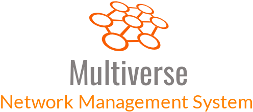

<p align="center">
  
</p>

# Multiverse Network Management System

## Overview

**Multiverse** is a research platform designed for configuring, monitoring, and managing optical quantum networks. It provides tools and frameworks for exploring the management of advanced quantum and optical network technologies.

### Supported Features
- **Optical Networks Management**: Integration with Polatis switches.
- **Wavelength Switching**: Work in progress for enhanced functionality.
- **Measurement Plane**: Tools for monitoring and collecting data from quantum network equipment.

[Watch the Demo!](https://www.youtube.com/watch?v=TVnK8tOqoho)

---

## Getting Started

The following instructions should work for **Ubuntu** and **Windows** environments.

### Prerequisites

Ensure the following are installed on your system:
- Docker
- Docker Compose
- Git Bash (for Windows)

### Configuration

1. Review the [run script](./prod/run.sh) before deploying Multiverse.
2. **Connecting to Polatis Switches**: 
   - Export login credentials as environment variables in the format `<username>:<password>`.
   - Ensure the environment variable names match the corresponding node names in the topology file (case-sensitive).

3. **User Access Management**:
   - Multiverse uses **Keycloak** for access management.
   - A basic Keycloak configuration will be initialized by the startup script, enabling local login via the GUI.
   - For remote GUI access, additional Keycloak endpoint configuration is required. *(Documentation: TBD)*

---

## Deployment

1. Open a terminal and run the following commands:
   ```bash
   git clone https://github.com/multiverse-nms/multiverse.git
   cd multiverse/prod
   chmod +x run.sh
   sudo ./run.sh -E
   ```

2. The `-E` flag ensures a complete setup, including environment initialization (e.g., proxy configuration).

---

## Accessing the Platform

### Graphical User Interface (GUI)
- Access the GUI at `http://localhost:8080`.
- Default credentials:  
  **Username**: `amar`
  **Password**: `amar00`

### Python Client
Multiverse also supports Python-based access.  
Refer to the [Multiverse Python Client Guide](https://github.com/multiverse-nms/multiverse-python-client) for more details.

---

## Measurement Plane
Details about using the Measurement Plane are under development. *(Documentation: TBD)*